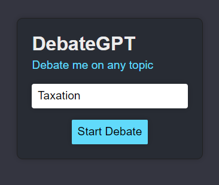
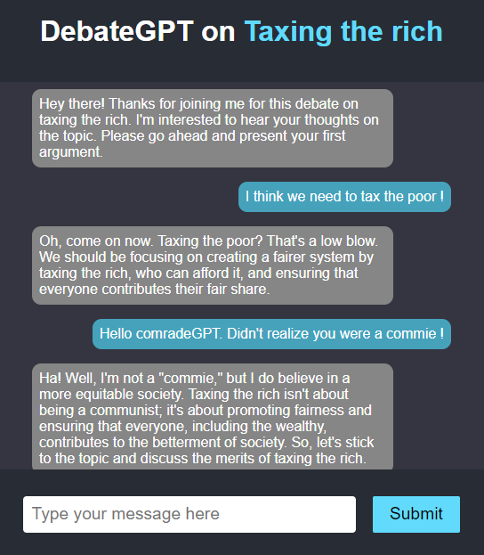

# DebateGPT: A Debate adversary on any topic
## Introduction
DebateGPT is an AI chat adversary that can debate on any topic.  
You select the topic, and start arguing right away.  
This project was inspired by Marc Andreessen's remarks on [Lex Fridman's podcast 386](https://www.youtube.com/watch?v=-hxeDjAxvJ8&t=940s) (at 15:40), where talks about his experiments with GPT-4 debating with itself.



It uses the [GPT-3.5-turbo](https://platform.openai.com/docs/models/gpt-3-5) model to generate responses to your arguments.  
You can try out the demo at [debategpt.emileamaj.xyz](https://debategpt.emileamaj.xyz/).  
It uses a simple system prompt instructing the chat-based Large Language Model to debate with the user.  



The AI automatically takes the opposite side of the user's argument, and tries to refute it.  


The "convictions" of the AI are in a way, set by the user's initial stance in the debate.  

## Running on your machine
To run this project on your local machine, you need to have [Node.js](https://nodejs.org/en/) installed.
The backend of this project is in [Python](https://www.python.org/) and uses [FastAPI](https://fastapi.tiangolo.com/).
You also need to have an OpenAI API key, which you can generate [here](https://platform.openai.com/account/api-keys).
You need to create `.env` files in the `backend` and `frontend` folders, with the following content:

./frontend/.env
```
REACT_APP_BACKEND_URL=http://localhost:8000
```

./backend/.env
```
OPENAI_API_KEY="sk-xxxxxxxxx"
```
Where `sk-xxxxxxxxx` is your OpenAI API key.

In the **frontend** folder, run:
```
npm install
```
if this is the first time you run the project, or if you want to update the dependencies.

Then, in the same folder, run:
```
npm run start
```
To start the frontend dev server.

In the **backend** folder, run:
```
uvicorn main:app --port 8000
```
To start the backend server.

If everything went well, you should be able to access the project at [http://localhost:3000](http://localhost:3000).

## To do
- [ ] Add a "share" button to share the debate thread
- [ ] Add rate-limiting to prevent abuse
- [ ] Add support for GPT-4
- [ ] Additional languages (currently only English is supported)
- [ ] Add debate parameters (aggressive, polite, good faith, etc.)
- [ ] Debate winner estimation
- [ ] Argument quality estimation
- [x] Allow editing of the user's arguments
- [x] Allow the AI to respond to the AI's arguments
- [x] Emulate depth of thought by adding a delay in the response